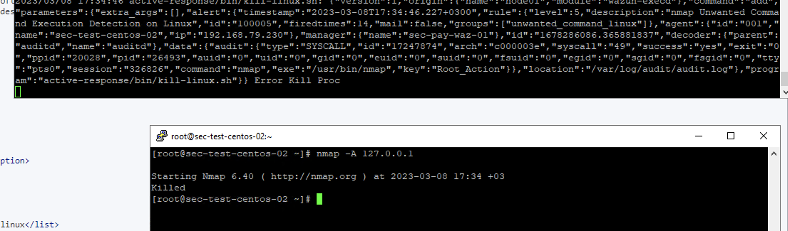

# WAZUH Active-Response : Blocking Unwanted Commands on Linux using CDB Lists

## Scenario

Let's assume that an unwanted command running on Linux device and we want them to be interrupted.

so lets follow the steps below

## Configuration on Agent

Remote commands may be specified in the centralized configuration, however, they are disabled by default due to security reasons.

When setting commands in a shared agent configuration, you must enable remote commands for Agent Modules.

This is enabled by adding the following line to the file "C:\Program Files (x86)\ossec-agent\local_internal_options.conf" in the agent:

	wazuh_command.remote_commands=1

### 1-) Linux Audit system

Debian 

	apt-get install auditd audispd-plugins

RPM

	yum install audit audit-libs

### 2-) Define Auditd Rules

vi /etc/audit/rules.d/audit.rules

	## First rule - delete all
	-D

	## Increase the buffers to survive stress events.
	## Make this bigger for busy systems
	-b 8192

	## Set failure mode to syslog
	-f 1

	-a always,exit -F arch=b64 -F euid=0 -F auid!=4294967295 -F perm=wxa -k Root_Action
	-a always,exit -F arch=b32 -F euid=0 -F auid!=4294967295 -F perm=wxa -k Root_Action
	-a always,exit -F arch=b64 -F euid!=0 -F auid!=4294967295 -F perm=wxa -k User_Action
	-a always,exit -F arch=b32 -F euid!=0 -F auid!=4294967295 -F perm=wxa -k User_Action

vi /etc/audit/auditd.conf		//Change Log Format

	log_format = ENRICHED

### 2-) Restart Auditd

	service auditd restart

### 3-) Define Monitoring

We add the following lines to the "/var/ossec/etc/ossec.conf" file to auditd events monitoring.

	<localfile>
    	<location>/var/log/audit/audit.log</location>
    	<log_format>audit</log_format>
	</localfile>

### 4-) Restart Wazuh Agent

	sudo systemctl restart wazuh-agent


## Configurations on Manager

### 1-) Creating the CDB list

A CDB list is a text file with key:value pairs. Each pair must be on a single line, and the keys must be unique. However, values are optional. In this post, We create a CDB List for unwanted commands.

To do this, create a file called malware-hashes in /var/ossec/etc/lists/ on the manager.

	vi /var/ossec/etc/lists/unwanted-commands-linux

Add your malicious MD5s to the file.:

	nmap:
	wget:

We proceed to add the created CDB list to the manager ossec.conf so it is available for use in rules. The list is added to the manager by specifying the path to the list in the <ruleset> block.

	<list>etc/lists/unwanted-commands-linux</list>

### 2-) Detecting Unwanted Command local_rules.xml
Once the list has been added to the configuration file, we proceed to create a custom rule in /var/ossec/etc/rules/local_rules.xml to alert when the command is found in the Unwanted Command Lists.

	<group name="linux_auditd,">
		<rule id="100004" level="5">
			<if_group>audit</if_group>
			<field name="audit.command">\.</field>
			<field name="audit.tty">^p</field>
			<description>$(audit.command) - Command Execution by - $(audit.tty)</description>
		</rule>
	</group>
	<group name="unwanted_command_linux,">
		<rule id="100005" level="5">
			<if_sid>100004</if_sid>
			<list field="audit.command" lookup="match_key">etc/lists/unwanted-commands-linux</list>
			<description>$(audit.command) Unwanted Command Execution Detection on Linux</description>
			<options>no_full_log</options>
		</rule>
	</group>

### 3-) Define Active Response on ossec.conf

Now that the active response executable has been placed in the bin folder on the agent, we proceed to configure the manager to trigger an active response when the unwanted command detection rule is triggered. In the manager configuration file, we add the following block in the ossec_config block:

	<command>
		<name>procKill</name>
		<executable>kill-linux.sh</executable>
		<timeout_allowed>no</timeout_allowed>
	</command>
	
	<active-response>
		<disabled>no</disabled>
		<level>10</level>
		<command>procKill</command>
		<location>local</location>
		<rules_id>100005</rules_id>
	</active-response>

### 4-) Restart Wazuh Manager
Restart the Wazuh manager to apply the configuration changes:

	sudo systemctl restart wazuh-manager


### 5-) Deploying Tool and Config

Note: I had previously divided agents into groups according to their operating systems, you can change the directories here according to the default or the directory you have configured yourself.

First of all, I create my .sh file that will take action under the file that will provide distribution to Linux.

cd /var/ossec/etc/shared/Linux/

	vi kill-linux.sh

I add the following commands to the remove-threat.sh file and save my file.

```
#!/bin/bash

LOCAL=`dirname $0`;
cd $LOCAL
cd ../

PWD=`pwd`
read INPUT_JSON
PID=$(echo $INPUT_JSON | jq -r .parameters.alert.data.audit.pid)
COMMAND=$(echo $INPUT_JSON | jq -r .command)
LOG_FILE="${PWD}/../logs/active-responses.log"

#------------------------ Analyze command -------------------------#
if [ ${COMMAND} = "add" ]
then
 # Send control message to execd
 printf '{"version":1,"origin":{"name":"Kill Proc","module":"active-response"},"command":"check_keys", "parameters":{"keys":[]}}\n'

 read RESPONSE
 COMMAND2=$(echo $RESPONSE | jq -r .command)
 if [ ${COMMAND2} != "continue" ]
 then
  echo "`date '+%Y/%m/%d %H:%M:%S'` $0: $INPUT_JSON Kill Proc active response aborted" >> ${LOG_FILE}
  exit 0;
 fi
fi

# Kill Proc
kill -9  $PID
if [ $? -eq 0 ]; then
 echo "`date '+%Y/%m/%d %H:%M:%S'` $0: $INPUT_JSON Successfully Kill Proc" >> ${LOG_FILE}
else
 echo "`date '+%Y/%m/%d %H:%M:%S'` $0: $INPUT_JSON Error Kill Proc" >> ${LOG_FILE}
fi

exit 0;

```


I add the following lines to the agent.conf file for kill-linux.sh file

	<wodle name="command">
		<disabled>no</disabled>
		<tag>kill-procc-wodle-move</tag>
		<command>mv /var/ossec/etc/shared/kill-linux.sh /var/ossec/active-response/bin/</command>
		<ignore_output>no</ignore_output>
		<run_on_start>yes</run_on_start>
	</wodle>
	<wodle name="command">
		<disabled>no</disabled>
		<tag>kill-procc-wodle-chmod</tag>
		<command>sudo chmod 750 /var/ossec/active-response/bin/kill-linux.sh</command>
		<ignore_output>no</ignore_output>
		<run_on_start>yes</run_on_start>
	</wodle>
	<wodle name="command">
		<disabled>no</disabled>
		<tag>kill-procc-wodle-chown</tag>
		<command>sudo chown root:wazuh /var/ossec/active-response/bin/kill-linux.sh</command>
		<ignore_output>no</ignore_output>
		<run_on_start>yes</run_on_start>
	</wodle>

### 6-) Restart Agents
	
	/var/ossec/bin/agent_control -R -a



