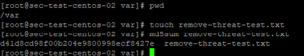
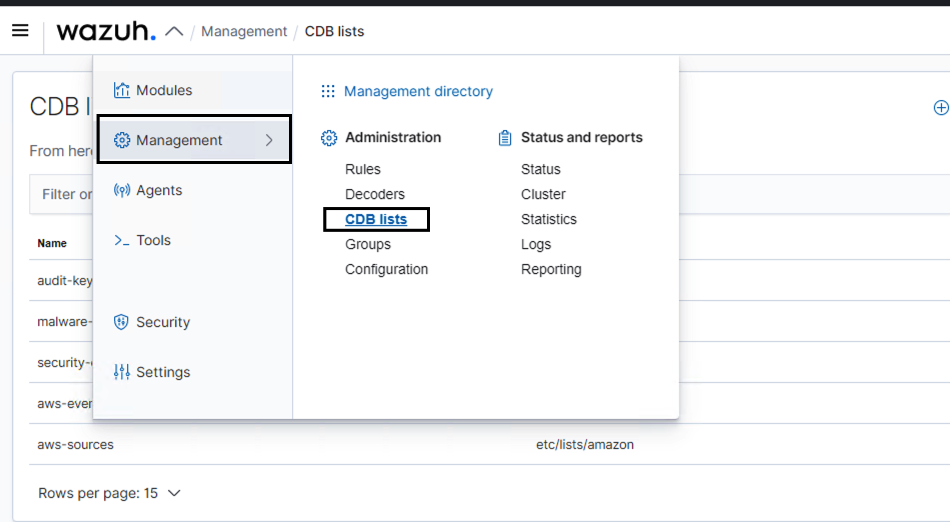
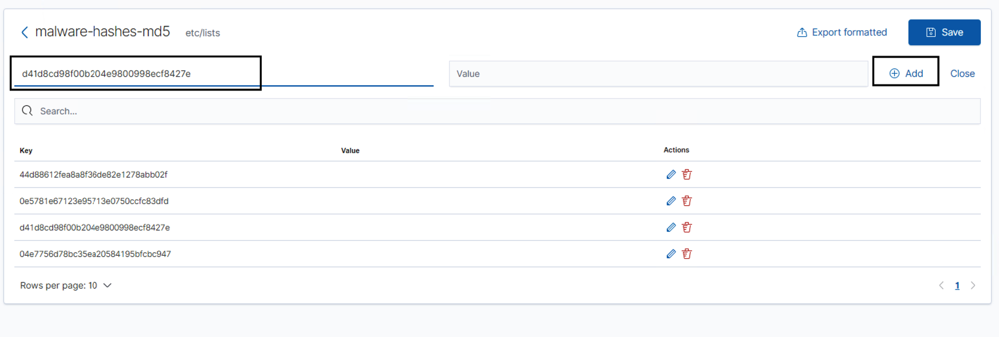
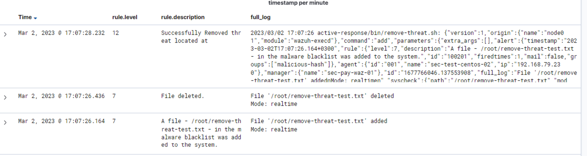
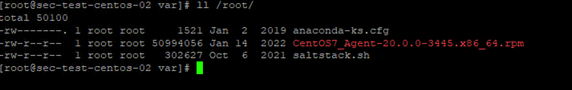

# WAZUH Active-Response : Remove-Threat by CDB List from Linux

## Scenario

Let's say you have a list of MD5 known to belong to malicious files.
Imagine that you are monitoring the /root directory with Wazuh.

If one of these malicious MD5's is in the /root directory, you want it to be deleted.

so lets follow the steps below

## Configuration on Agent

Remote commands may be specified in the centralized configuration, however, they are disabled by default due to security reasons.

When setting commands in a shared agent configuration, you must enable remote commands for Agent Modules.

This is enabled by adding the following line to the file etc/local_internal_options.conf in the agent:

	wazuh_command.remote_commands=1

### Restart Wazuh Agent

	sudo systemctl restart wazuh-agent


## Configurations on Manager

### 1-) Creating the CDB list

A CDB list is a text file with key:value pairs. Each pair must be on a single line, and the keys must be unique. However, values are optional. In this post, we use a CDB list to create a malware blacklist containing MD5 hashes of known malicious files.

To do this, create a file called malware-hashes in /var/ossec/etc/lists/ on the manager.

	vi /var/ossec/etc/lists/malware-hashes-md5

Add your malicious MD5s to the file.:

	44d88612fea8a8f36de82e1278abb02f:
	0e5781e67123e95713e0750ccfc83dfd:
	d41d8cd98f00b204e9800998ecf8427e:
	04e7756d78bc35ea20584195bfcbc947:

We proceed to add the created CDB list to the manager ossec.conf so it is available for use in rules. The list is added to the manager by specifying the path to the list in the <ruleset> block.

	<list>etc/lists/malware-hashes-md5</list>

### 2-) Detecting malicious files on local_rules.xml
Once the list has been added to the configuration file, we proceed to create a custom rule in /var/ossec/etc/rules/local_rules.xml to alert when the hash of a downloaded file is found in the malware blacklist.

	<group name="malicious-hash">    //Group name is important to Active Response
		<rule id="100092" level="12">
			<if_sid>657</if_sid>
			<match>Successfully removed threat</match>
			<description>Successfully Removed threat located at $(file)</description>
		</rule>

		<rule id="100093" level="12">
			<if_sid>657</if_sid>
			<match>Error removing threat</match>
			<description>Error removing threat located at $(file)</description>
		</rule>
		
		<rule id="100200" level="7">
			<if_sid>550</if_sid>
			<list field="md5" lookup="match_key">etc/lists/malware-hashes-md5</list>
			<description>A file - $(file) - in the malware blacklist was modified to the system.</description>
		</rule>
		<rule id="100201" level="7">
			<if_sid>554</if_sid>
			<list field="md5" lookup="match_key">etc/lists/malware-hashes-md5</list>
			<description>A file - $(file) - in the malware blacklist was added to the system.</description>
		</rule>
		
		<rule id="100003" level="5">
			<if_sid>100201</if_sid>
			<field name="file" type="pcre2">(?i)[c-z]:</field>
			<description>A file - $(file) - in the malware blacklist was added to the system.</description>
		</rule>
		<rule id="100004" level="5">
			<if_sid>100200</if_sid>
			<field name="file" type="pcre2">(?i)[c-z]:</field>
			<description>A file - $(file) - in the malware blacklist was modified to the system.</description>
		</rule>
	</group>

### 3-) Define Active Response on ossec.conf

Now that the active response executable has been placed in the bin folder on the agent, we proceed to configure the manager to trigger an active response when the malware blacklist detection rule is triggered. In the manager configuration file, we add the following block in the ossec_config block:

	<!-- ############ Custom Active Responses Start ################# -->
	<command>
		<name>remove-threat</name>
		<executable>remove-threat.sh</executable>
		<timeout_allowed>no</timeout_allowed>
	</command>

	<active-response>
		<disabled>no</disabled>
		<command>remove-threat</command>
		<location>local</location>
		<rules_group>malicious-hash</rules_group>
	</active-response>
	
	<!-- ############ Custom Active Responses END ################# -->

### 4-) Restart Wazuh Manager
Restart the Wazuh manager to apply the configuration changes:

	sudo systemctl restart wazuh-manager

### 5-) Deploy Tool amd Config

Note: I had previously divided agents into groups according to their operating systems, you can change the directories here according to the default or the directory you have configured yourself.

First of all, I create my .sh file that will take action under the file that will provide distribution to Linux.

	cd /var/ossec/etc/shared/Linux/

	vi remove-threat.sh

```
I add the following commands to the remove-threat.sh file and save my file.

#!/bin/bash

LOCAL=`dirname $0`;
cd $LOCAL
cd ../

PWD=`pwd`

read INPUT_JSON
FILENAME=$(echo $INPUT_JSON | jq -r .parameters.alert.syscheck.path)
COMMAND=$(echo $INPUT_JSON | jq -r .command)
LOG_FILE="${PWD}/../logs/active-responses.log"

#------------------------ Analyze command -------------------------#
if [ ${COMMAND} = "add" ]
then
 # Send control message to execd
 printf '{"version":1,"origin":{"name":"remove-threat","module":"active-response"},"command":"check_keys", "parameters":{"keys":[]}}\n'

 read RESPONSE
 COMMAND2=$(echo $RESPONSE | jq -r .command)
 if [ ${COMMAND2} != "continue" ]
 then
  echo "`date '+%Y/%m/%d %H:%M:%S'` $0: $INPUT_JSON Remove threat active response aborted" >> ${LOG_FILE}
  exit 0;
 fi
fi

# Removing file
rm -f $FILENAME
if [ $? -eq 0 ]; then
 echo "`date '+%Y/%m/%d %H:%M:%S'` $0: $INPUT_JSON Successfully removed threat" >> ${LOG_FILE}
else
 echo "`date '+%Y/%m/%d %H:%M:%S'` $0: $INPUT_JSON Error removing threat" >> ${LOG_FILE}
fi

exit 0;
```

I add the following lines to the agent.conf file so that both the /root directory can be monitored and the remove-threat.sh file can take action.

	<agent_config>
		<wodle name="command">
			<disabled>no</disabled>
			<tag>remove-threat-wodle-move</tag>
			<command>mv /var/ossec/etc/shared/remove-threat.sh /var/ossec/active-response/bin/</command>
			<ignore_output>no</ignore_output>
			<run_on_start>yes</run_on_start>
		</wodle>
		<wodle name="command">
			<disabled>no</disabled>
			<tag>remove-threat-wodle-chmod</tag>
			<command>sudo chmod 750 /var/ossec/active-response/bin/remove-threat.sh</command>
			<ignore_output>no</ignore_output>
			<run_on_start>yes</run_on_start>
		</wodle>
		<wodle name="command">
			<disabled>no</disabled>
			<tag>remove-threat-wodle-chown</tag>
			<command>sudo chown root:wazuh /var/ossec/active-response/bin/remove-threat.sh</command>
			<ignore_output>no</ignore_output>
			<run_on_start>yes</run_on_start>
		</wodle>

		<!-- Shared agent configuration here -->
		<syscheck>
			<disabled>no</disabled>
			<directories check_all="yes" realtime="yes">/root</directories>
			<directories check_all="yes" realtime="yes">/opt</directories>
		</syscheck>
	</agent_config>

## Attack emulation

### 1-) Create Test File and Get MD5

	cd /var

	touch remove-threat-test.txt

	md5sum remove-threat-test.txt



### 2-) Add your malicious MD5s to the file from WebUI





### 3-) Move Test File to /root directory from /var

	mv /var/remove-threat-test.txt /root/

### 4-) See Actions from Discover Page






