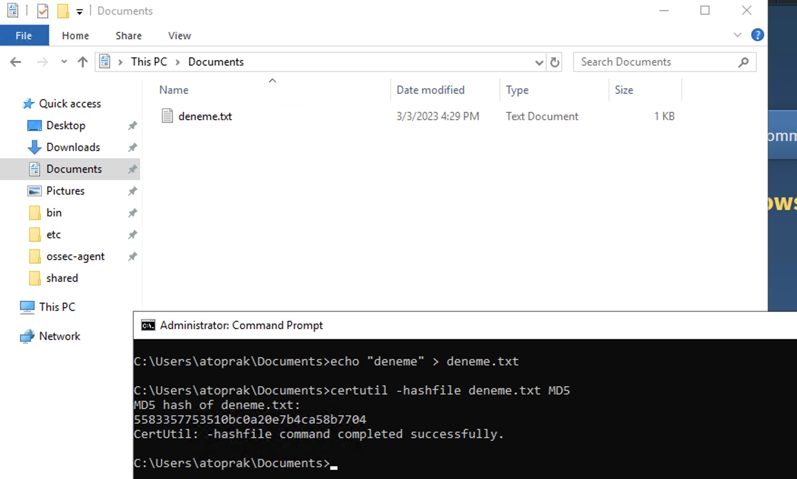
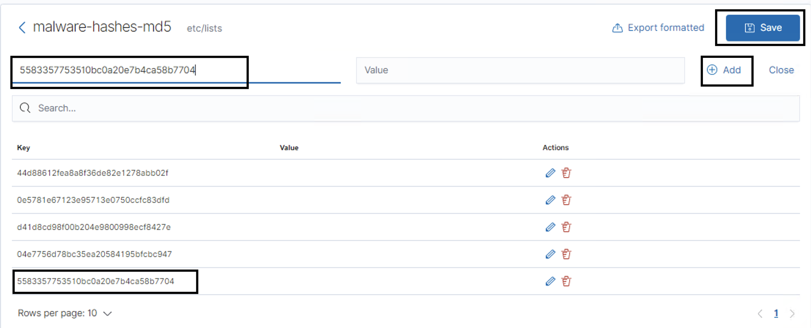
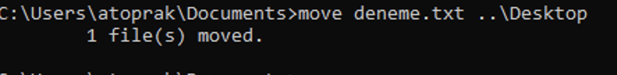
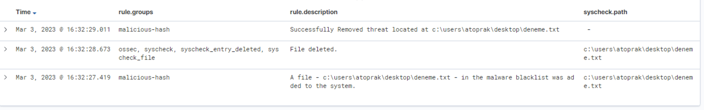

# WAZUH Active-Response : Remove-Threat by CDB List from Windows

## Scenario

Let's say you have a list of MD5 known to belong to malicious files.
Imagine that you are monitoring the "C:\Users\*\Desktop" directory with Wazuh.

If one of these malicious MD5's is in the "C:\Users\*\Desktop directory", you want it to be deleted.

so lets follow the steps below

## Configuration on Agent

Remote commands may be specified in the centralized configuration, however, they are disabled by default due to security reasons.

When setting commands in a shared agent configuration, you must enable remote commands for Agent Modules.

This is enabled by adding the following line to the file "C:\Program Files (x86)\ossec-agent\local_internal_options.conf" in the agent:

	wazuh_command.remote_commands=1

### 1-) Install Python3
Download the Python executable installer from the official Python website.

### 2-) Install Python3
Download the Python executable installer from the official Python website.

Run the Python installer once downloaded. Make sure to check the following boxes:

	Install launcher for all users

	Add Python 3.X to PATH (This places the interpreter in the execution path)

Once Python completes the installation process, open an administrator PowerShell terminal and use pip to install PyInstaller:

	pip install pyinstaller
	pyinstaller --version

### 3-) Create an active response script

Create an active response script "remove-threat.py" to remove a file from the Windows endpoint:

	#!/usr/bin/python3
	# Copyright (C) 2015-2022, Wazuh Inc.
	# All rights reserved.
	
	import os
	import sys
	import json
	import datetime
	
	if os.name == 'nt':
		LOG_FILE = "C:\\Program Files (x86)\\ossec-agent\\active-response\\active-responses.log"
	else:
		LOG_FILE = "/var/ossec/logs/active-responses.log"
	
	ADD_COMMAND = 0
	DELETE_COMMAND = 1
	CONTINUE_COMMAND = 2
	ABORT_COMMAND = 3
	
	OS_SUCCESS = 0
	OS_INVALID = -1
	
	class message:
		def __init__(self):
			self.alert = ""
			self.command = 0
	
	def write_debug_file(ar_name, msg):
		with open(LOG_FILE, mode="a") as log_file:
			log_file.write(str(datetime.datetime.now().strftime('%Y/%m/%d %H:%M:%S')) + " " + ar_name + ": " + msg +"\n")
	
	def setup_and_check_message(argv):
	
		# get alert from stdin
		input_str = ""
		for line in sys.stdin:
			input_str = line
			break
	
	
		try:
			data = json.loads(input_str)
		except ValueError:
			write_debug_file(argv[0], 'Decoding JSON has failed, invalid input format')
			message.command = OS_INVALID
			return message
	
		message.alert = data
	
		command = data.get("command")
	
		if command == "add":
			message.command = ADD_COMMAND
		elif command == "delete":
			message.command = DELETE_COMMAND
		else:
			message.command = OS_INVALID
			write_debug_file(argv[0], 'Not valid command: ' + command)
	
		return message
	
	
	def send_keys_and_check_message(argv, keys):
	
		# build and send message with keys
		keys_msg = json.dumps({"version": 1,"origin":{"name": argv[0],"module":"active-response"},"command":"check_keys","parameters":{"keys":keys}})
	
		write_debug_file(argv[0], keys_msg)
	
		print(keys_msg)
		sys.stdout.flush()
	
		# read the response of previous message
		input_str = ""
		while True:
			line = sys.stdin.readline()
			if line:
				input_str = line
				break
	
		# write_debug_file(argv[0], input_str)
	
		try:
			data = json.loads(input_str)
		except ValueError:
			write_debug_file(argv[0], 'Decoding JSON has failed, invalid input format')
			return message
	
		action = data.get("command")
	
		if "continue" == action:
			ret = CONTINUE_COMMAND
		elif "abort" == action:
			ret = ABORT_COMMAND
		else:
			ret = OS_INVALID
			write_debug_file(argv[0], "Invalid value of 'command'")
	
		return ret
	
	def main(argv):
	
		write_debug_file(argv[0], "Started")
	
		# validate json and get command
		msg = setup_and_check_message(argv)
	
		if msg.command < 0:
			sys.exit(OS_INVALID)
	
		if msg.command == ADD_COMMAND:
			alert = msg.alert["parameters"]["alert"]
			keys = [alert["rule"]["id"]]
			action = send_keys_and_check_message(argv, keys)
	
			# if necessary, abort execution
			if action != CONTINUE_COMMAND:
	
				if action == ABORT_COMMAND:
					write_debug_file(argv[0], "Aborted")
					sys.exit(OS_SUCCESS)
				else:
					write_debug_file(argv[0], "Invalid command")
					sys.exit(OS_INVALID)
	
			try:
				os.remove(msg.alert["parameters"]["alert"]["syscheck"]["path"])
				write_debug_file(argv[0], json.dumps(msg.alert) + " Successfully removed threat")
			except OSError as error:
				write_debug_file(argv[0], json.dumps(msg.alert) + "Error removing threat")
			
		
		else:
			write_debug_file(argv[0], "Invalid command")
	
		write_debug_file(argv[0], "Ended")
	
		sys.exit(OS_SUCCESS)
	
	if __name__ == "__main__":
		main(sys.argv)

### 4-) Convert the active response Python script remove-threat.py to a Windows executable application

Convert the active response Python script remove-threat.py to a Windows executable application. Run the following PowerShell command as an administrator to create the executable:

	pyinstaller -F \path_to_remove-threat.py

Take note of the path where pyinstaller created remove-threat.exe

### 5-) Move the executable file

Move the executable file remove-threat.exe to the C:\Program Files (x86)\ossec-agent\active-response\bin directory.

### 6-) Restart Wazuh Agent
Restart the Wazuh agent to apply the changes. Run the following PowerShell command as an administrator:

	Restart-Service -Name wazuh

## Configurations on Manager

### 1-) Creating the CDB list

A CDB list is a text file with key:value pairs. Each pair must be on a single line, and the keys must be unique. However, values are optional. In this post, we use a CDB list to create a malware blacklist containing MD5 hashes of known malicious files.

To do this, create a file called malware-hashes in /var/ossec/etc/lists/ on the manager.

	vi /var/ossec/etc/lists/malware-hashes-md5

Add your malicious MD5s to the file.:

	44d88612fea8a8f36de82e1278abb02f:
	0e5781e67123e95713e0750ccfc83dfd:
	d41d8cd98f00b204e9800998ecf8427e:
	04e7756d78bc35ea20584195bfcbc947:

We proceed to add the created CDB list to the manager ossec.conf so it is available for use in rules. The list is added to the manager by specifying the path to the list in the <ruleset> block.

	<list>etc/lists/malware-hashes-md5</list>

### 2-) Detecting malicious files on local_rules.xml
Once the list has been added to the configuration file, we proceed to create a custom rule in /var/ossec/etc/rules/local_rules.xml to alert when the hash of a downloaded file is found in the malware blacklist.

	<group name="malicious-hash">
		<rule id="100092" level="12">
			<if_sid>657</if_sid>
			<match>Successfully removed threat</match>
			<description>Successfully Removed threat located at $(parameters.alert.syscheck.path)</description>
		</rule>

		<rule id="100093" level="12">
			<if_sid>657</if_sid>
			<match>Error removing threat</match>
			<description>Error removing threat located at $(parameters.alert.syscheck.path)</description>
		</rule>
		
		<rule id="100200" level="7">
			<if_sid>550</if_sid>
			<list field="md5" lookup="match_key">etc/lists/malware-hashes-md5</list>
			<description>A file - $(file) - in the malware blacklist was modified to the system.</description>
		</rule>
		<rule id="100201" level="7">
			<if_sid>554</if_sid>
			<list field="md5" lookup="match_key">etc/lists/malware-hashes-md5</list>
			<description>A file - $(file) - in the malware blacklist was added to the system.</description>
		</rule>
		
		<rule id="100003" level="5">
			<if_sid>100201</if_sid>
			<field name="file" type="pcre2">(?i)[c-z]:</field>
			<description>A file - $(file) - in the malware blacklist was added to the system.</description>
		</rule>
		<rule id="100004" level="5">
			<if_sid>100200</if_sid>
			<field name="file" type="pcre2">(?i)[c-z]:</field>
			<description>A file - $(file) - in the malware blacklist was modified to the system.</description>
		</rule>
	</group>

### 3-) Define Active Response on ossec.conf

Now that the active response executable has been placed in the bin folder on the agent, we proceed to configure the manager to trigger an active response when the malware blacklist detection rule is triggered. In the manager configuration file, we add the following block in the ossec_config block:

	<!-- ############ Custom Active Responses Start ################# -->
	<command>
		<name>remove-threat-win</name>
		<executable>remove-threat.exe</executable>
		<timeout_allowed>no</timeout_allowed>
	</command>
	
	<active-response>
		<disabled>no</disabled>
		<command>remove-threat-win</command>
		<location>local</location>
		<rules_group>malicious-hash</rules_group>
	</active-response>
	
	<!-- ############ Custom Active Responses END ################# -->

### 4-) Restart Wazuh Manager
Restart the Wazuh manager to apply the configuration changes:

	sudo systemctl restart wazuh-manager

## Deploying Config

Note: I had previously divided agents into groups according to their operating systems, you can change the directories here according to the default or the directory you have configured yourself.

First of all, I create my .sh file that will take action under the file that will provide distribution to Windows.

	cd /var/ossec/etc/shared/Windows/

I add the following lines to the agent.conf file so that both the /root directory can be monitored and the remove-threat.sh file can take action.

	<agent_config>
		<!-- Shared agent configuration here -->
		<syscheck>
			<disabled>no</disabled>
			<directories check_all="yes" report_changes="yes" realtime="yes">C:\Users\*\Desktop</directories>
		</syscheck>
	</agent_config>

## Attack Simulation

### 1-) Create Test File and Get MD5

	cd /var

	touch remove-threat-test.txt

	md5sum remove-threat-test.txt

### 2-) Add your malicious MD5s to the file from WebUI

### 3-) Move Test File to \Desktop directory from \Documents

### 4-) See Actions from Discover Page

